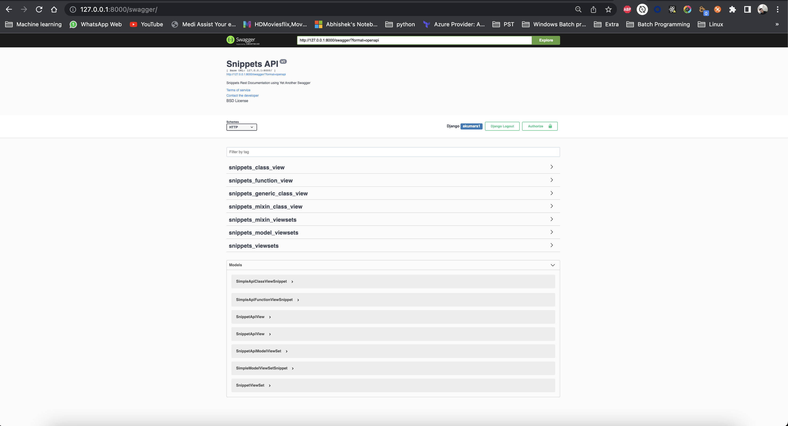

# Explore Django Rest With DRF-Yasg (Yet Another Swagger)

## Wrote Rest Web service Using Django Rest Framework and created documentation using Swagger

- Simple Api (Not Visible in swagger)
- Function Based View
- Class Based View
- Class Mixins
- Generic Class View
- ViewSets
- ModelViewSets
- MixinViewSets

